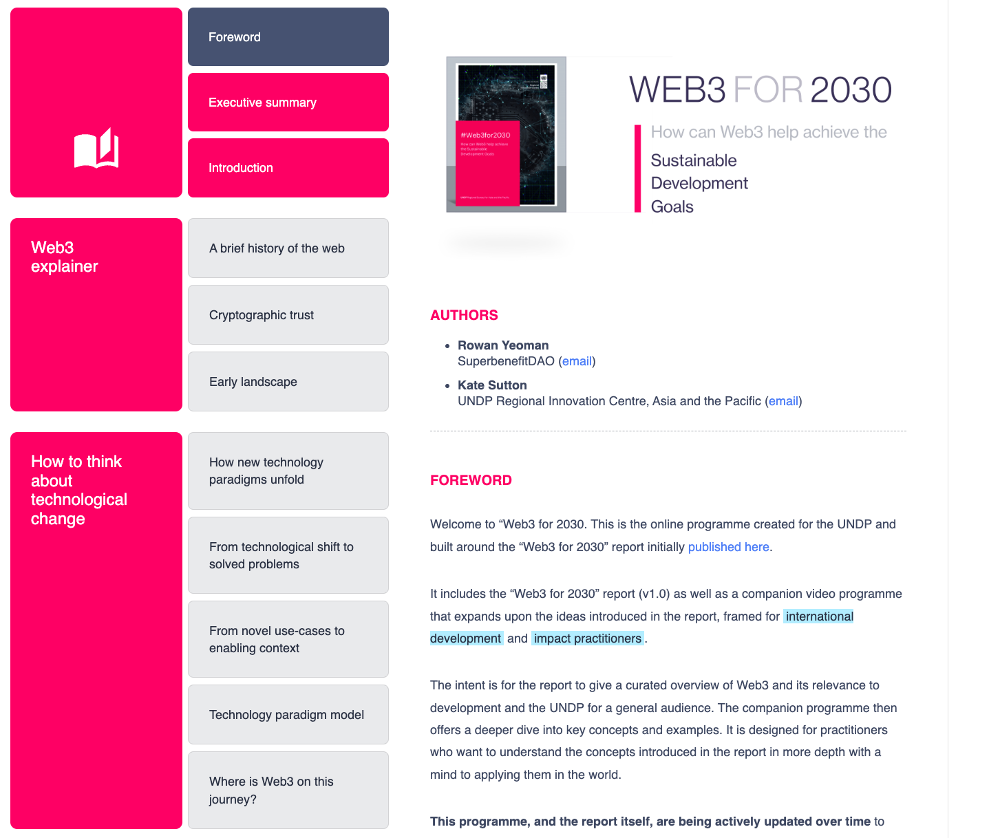

# An Overview of Web3

A basic knowledge of crypto/web3 concepts will help you in two main ways.&#x20;

1. Firstly it will help you understand and engage with the different crypto/web3 tools and practices that we will be using to coordinate community participation in this project.&#x20;
2. But more importantly, having a basic understanding of the core concepts of crypto/web3 will help you understand and engage with the core idea of the energy labelling protocol and of all the possible innovations that can stem from it.&#x20;

<figure><figcaption></figcaption></figure>

In [Web3 For 2030](https://undp.db.team/web3/) (a project we created for the UNDP), we cover the fundamentals of crypto/web3, how to understand its evolution - from speculative beginnings, to new technology paradigm, and how it can enable positive social and environmental impact.&#x20;

For those new to crypto/web3 wanting to gain a quick overview of the subject, we recommend working through the following sections in [Web3 For 2030](https://undp.db.team/web3/):

* A brief history of the web
* Cryptographic trust
* Early landscape

To go deeper into how crypto/web3 is emerging as a technological paradigm, work through the section titled [_How to think about technological change._](https://undp.db.team/web3/)

The section entitled[ _Web3 opportunities_](https://undp.db.team/web3/) will help you understand the novel mechanisms and dynamics at play. These will help you make sense of the transformational potential of the Windfall Protocol project.  &#x20;

The rest of the document relates to the UNDP and the SDGs more specifically. But do refer to the section on [_Technology Risks_](https://undp.db.team/web3/) to understand the reality of things like the energy consumption of blockchains or privacy and security issues if these are of particular concern for you.&#x20;

If after this introduction you are interested to go deeper, the following resources have some useful write-ups, programmes and other material that goes deeper into specific aspects of crypto/web3.

* [SuperBenefit web3 Library](https://superbenefit.notion.site/web3-Library-7819e3c7a9fb482998cad3822e5dcb82)
* [Coinbase/learn  ](https://www.coinbase.com/learn)
* [We Teach Blockchain](https://weteachblockchain.org/)
* [The SuperBenefit discord](https://discord.gg/kDdbnRpS) - beyond the Windfall Protocol project specific channels in the SuperBenefit discord you will find other channels with past and current conversations that can help broaden your knowledge of crypto/web3 and its potential.&#x20;

