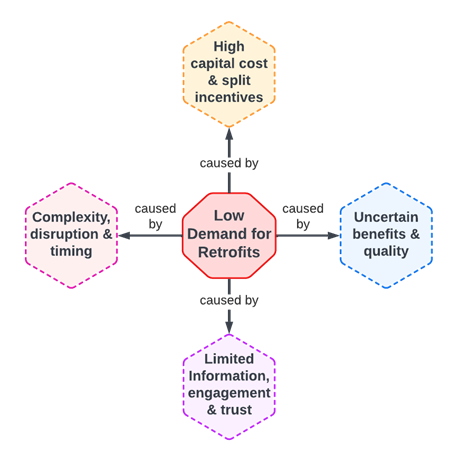

---
layout:
  title:
    visible: true
  description:
    visible: false
  tableOfContents:
    visible: true
  outline:
    visible: true
  pagination:
    visible: true
---

# Program Requirements

The Windfall Protocol Program aims to address key challenges in retrofitting for energy efficiency by outlining specific program requirements. These include improving rebate programs, streamlining retrofit processes, and ensuring verifiable data transparency. The protocol also focuses on targeted incentives based on energy efficiency outcomes.&#x20;

By exploring functional domains and technological considerations, the program seeks to create a shared data infrastructure accessible to all stakeholders, thereby enhancing retrofit demand and facilitating a transition towards net-zero targets.

* [Requirements Overview](requirements.md#overview-of-requirements)
* [Technical Considerations](requirements.md#technical-considerations)
* [Minimum-Viable Implementation](requirements.md#durham-region-pilot-minimum-viable-protocol-implementation)
* [Feedback & Discussion](requirements.md#feedback-and-discussion)

## Overview of Requirements

* [Functional Domains](requirements.md#functional-domains)
* [Protocol Building Blocks](requirements.md#protocol-building-blocks)

We begin the design explorations of the Windfall Protocol Program by outlining requirements. As seen in Figure 1 below, low demand for retrofits has many causes, including capital costs, misaligned incentives, information fragmentation, complexity, and uncertainty. A protocol aiming to streamline retrofit demand will need to address each of these causes in turn.

<figure><figcaption>
Figure 1: Demand for Retrofits
</figcaption></figure>

To address these causes of low retrofit demand, the goals of this program are to enable:

* Improved rebate programs and financing options
* A streamlined retrofit process
* Verifiable data transparency and monitoring, while respecting user and data privacy
* Enabling targeted closed-loop incentives from realized energy efficiency outcomes

### Functional Domains

To enable these improvements, we begin by exploring and analyzing initial requirements for the Windfall Protocol Program in relation to their functional domains and stakeholders they impact.

#### Technological domain

* A shared data infrastructure with permission able access for all stakeholders
* The capability for stakeholders to read and write to the ledger from various data sources within their permission set
* A method to register various data schemas to the data infrastructure, such as Green Button energy data, building data, or audit data and indicate privacy considerations
* A method to log attestations (verifications) to the data infrastructure, to append external data sources such as energy feeds or audit reports
* An open API and an open source code repository (with documentation) for additional application development and extension
* A method to index, filter, and aggregate building data across multiple parameters for various uses (such as surfacing high impact retrofit opportunities for cross-sectional groups)
* A method to measure retrofit attestations against reported energy usage
* A method to address jurisdictional data residency requirements

#### Governance Domain

* A method to assign and revoke ledgers to building addresses
* A method to assign and update various stakeholders credentials, permissions, and access control
* A method to govern updates or changes in data schemas and formats
* A method to govern updates to the underlying protocol

#### Economic Domain

* A method to create, update, and automate targeted incentive policies and performance-based contracts
* A method to support ongoing research and development of the protocol along with maintenance costs of infrastructure
* A method to align interests of participants with the success of the protocol and improved net zero outcomes

### Protocol Building Blocks

Based on these requirements, the Windfall Protocol Research Group has identified three primary building blocks for a protocol to enable these functionalities: the building ledger, which serves as a central repository for any relevant building data, an attestation and credentialing service, which assigns access permissions to control who has read and write access and verifies external data updates to the ledger, and a targeted incentive policy designer that will allow policymakers to set targeted and conditional rebates and subsidies to meet net-zero targets by better-suiting energy efficiency incentives to local needs and context.\
\
These building blocks all exist within the shared governance of the Windfall Protocol, which would be minimally restrictive to suit different deployments of the protocol in wide-ranging circumstances. This layer would support upholding data privacy requirements, oversee data standards updates, and provide input on the economics of the protocol such as fees to support ongoing research, development, and infrastructure operations and maintenance, along with other economic considerations.

#### Building Ledger

Windfall Protocol proposes to address the issue of fractured data by centering on the building itself, often an invisible entity in retrofit programs. By assigning each building a ledger of account, homeowners have one secure location where they can store building data, audit and retrofit information, and even the resulting changes to its energy footprint. By aggregating all information relevant to a building in one place, the building ledger acts like a permissioned database that can be accessed by stakeholders with appropriate credentials. This also makes it possible to perform closed-loop analysis by connecting retrofits to actual energy efficiency outcomes, a benefit to regulators and policy-makers who seek to improve retrofit programs and better target incentives.

The building ledger also must be able to register updates to building data through appended data, such as audit reports. This leads to the need for another core component - an attestation and credentialing service that can permission actors to reliably interact with these data feeds and append new data to the building ledger. The attestation service would enable the building ledger to store verifiable proofs of real-world data related to audits, equipment, energy usage, or any associated files or records that are relevant to the building and its energy efficiency.

#### Targeted Incentive Policy Designer

In addition to the building ledger and attestation service, another building block in the Windfall Protocol is a targeted incentive policy designer for municipalities, governments, or other entities to offer targeted incentives and financing options to accelerate retrofits. This could be done extremely granularly based on various parameters like building size, a particular retrofit upgrade, or could filter to aggregate data and identify larger-scale retrofits by regional climate or other shared parameters.

Some examples of targeted incentive policies could include:

* Energy efficiency/reduction contests based on measurable energy outcomes
  * E.g. The top three households to reduce energy over a month in a given region win $100 off their home energy bill
* Improved automation & data analysis to identify high leverage retrofit engagementE.g. Policymakers able to identify and prioritize building types or regions eligible for mass retrofits
* Conditional incentive policy design across multiple building attributes
  * E.g. In \[municipalities / buildings / residential or commercial / etc.] that meet conditions of \[-15C avg winter temperature / >50 year build / etc.], apply incentive towards \[heat pump installation / new window & door quote / etc.] in the form of \[direct rebate / 0% interest loan / etc.]

#### Interfaces & Applications

With protocol building blocks serving as the core infrastructure, municipalities, utility companies, other stakeholders (or collaborating stakeholders), and third-party service providers could build other protocols, interfaces, and applications on top for accessing or creating data dashboards or financing offers for example. These applications could also be open-sourced, modularized, and then customized to suit different jurisdictions and stakeholder needs.

***

## Technical Considerations

* [Data Architecture](requirements.md#data-architecture)
* [Data Types](requirements.md#data-types)
* [Access Control](requirements.md#data-access-control)

Prior to implementation of the Windfall Protocol building blocks, there are several technological domain considerations to be explored. In this section, we outline some of the relevant characteristics of distributed data architectures that could sidestep some of the challenges of centralized data and decision-making silos, to provide desired properties of extensibility and interoperability to the protocol. We will also explore the types and formats of data that will be involved in the Windfall Protocol, as well as data access control considerations to ensure data privacy, sovereignty, and integrity. We also examine the energy implications of the technical infrastructure itself, to ensure its integrity and alignment with the program’s goals

### Data Architecture

Windfall Protocol proposes a data architecture that leverages blockchain technology for data storage, routing, and availability as needed. Blockchains were built to facilitate decentralized networks, resources, and assets, and are increasingly being adopted at an institutional scale. Several features of blockchain technologies lend themselves to providing permissioned access to multiple stakeholder groups over intersecting data. Their benefits could be applied to the challenges faced in accelerating reductions in building energy consumption via the following key properties:

#### Shared Decentralized Infrastructure

Part of the reason for the difficulty of data management in multi-stakeholder ecosystems is the centralization of data storage and access. These data silos lead to information asymmetries in energy retrofit ecosystems, limiting the coordinative capacity of involved stakeholders. Blockchains address this challenge by providing a shared data infrastructure that can be accessed by all stakeholders who hold adequate permissions. Shared infrastructure also implies reduced costs compared with a bespoke database solution, and guarantees modular composability, holding the potential to accelerate adoption and innovation.

#### Immutable Data Integrity

Another key requirement of the protocol architecture is data integrity and availability. The structure of blockchain architectures, a ‘chain’ of data ‘blocks’ all linked together through cryptographic hashing, provides guarantees for the integrity and availability of data in energy efficiency monitoring. In this way, blockchains can enable safe, low-cost sharing of data with varied privacy and permissions while guaranteeing data integrity.

#### Automated Smart Contracts

Certain blockchain architectures also offer smart contracts that could enable conditional processes and automated incentives in energy efficiency programs. This could allow incentives to be programmatically delivered, based on verified actions and outcomes, lowering costs of manual monitoring, and improving retrofit ecosystem efficacy.

#### Data Privacy, Security & Sovereignty

Storing private data on public ledgers can often be a point of contention for institutional uses of blockchain infrastructure. However, private data need not be stored on-chain at all, since verifiable attestations act as reliable proof of their existence off-chain.

The choice of data storage architecture must keep data security, privacy, and sovereignty as key considerations, with configuration capacities that can uphold legal and jurisdictional requirements and respect First Nations Principles.

The architecture and protocol economics should also enable data intermediaries to add value to data products and receive fair compensation rather than extracting value and creating asymmetries that counter the public good

#### Real-World Assets & Data Markets

Applications of blockchain technology for the stewardship of real-world assets and climate solutions have also gained rapid popularity in the last few years, with markets for carbon credits as a primary use case. Regen Network  has been a leader in bringing carbon credit offset markets on-chain, setting off a flurry of institutional exploration into the use of blockchains to manage tokenized “real-world” assets.

#### Energy Efficiency of Technological Infrastructure

Much like other electricity-powered technologies such as cloud computing, social networks, and artificial intelligence, developers of these technologies are working towards reducing energy consumption by decarbonizing operations, bringing more transparency in renewable energy usage, and adapting mechanisms to facilitate sustainable industry growth.   Research suggests DLTs could even be an ally in reducing the energy consumption of existing systems (like replacing some energy-intensive payment systems with the latest digital currency technologies that consume less energy), driving the decentralization of energy production,  and supporting energy load balancing with smart grids.

### Data Types

In looking at data architectures, it is important to also understand what types of data will flow through the system. The two primary types of data that the building ledger will be tracking are Building Data and Energy Data. By appending timestamped updates of building and energy data to the building ledger, including audits and retrofits, the Windfall Protocol aims to address the core challenge of siloed data in the retrofit process.

**Building Data**

Building data includes information such as the building envelope to understand heat and energy losses, building equipment that delineates energy demand, and property information that can inform the building’s capacity for renewable energy solutions. Data can be held by disparate authorities such as municipalities and real estate assessment corporations and may be accessible through sharing agreements with regional partnerships.

**Audit & Retrofit Data**

Building data can be updated through audits (virtual or manual), which take place both before and after retrofit installations are completed. Retrofit data is recorded in audits, and audit reports can be considered ‘state updates’ to existing Building Data. Audits form a pre- and post-snapshot of the energy profile of a building, establishing a baseline against which to measure efficiency improvements.

**Energy Data**

Energy usage data for a building is now available for download and use by over 60 million North American consumers through the Green Button standard for energy data access. The Green Button Alliance also has an API for third-party apps to connect with energy data streams, which could be stored or attested to on the building ledger.

**Metadata**

Metadata can be colloquially defined as “data about data”.  In addition to data about the building itself, its energy footprint, and retrofit updates, building ledgers could also track metadata about the building, such as part numbers and certifications of the various hardware or equipment installed.  Tracking the model version of installed smart meters, for example, could greatly improve data availability that could help to scale future retrofit opportunities by highlighting compatibility requirements ahead of recommended retrofits

**Additional Data Formats**

Data incorporated by the Windfall Protocol could be extended to include additional data formats relevant to a building, such as water data, property tax data, or any other information about the building and its features. New data and file types could be included over time by including their schemas in the attestation service to enable structured data access and analysis.

### Access Control

Data control and permissioning in the Windfall Protocol must prioritize the privacy of the homeowner, and the security and sovereignty of data for all participating stakeholder parties. Model-View-Controller is a general software design pattern that is used to develop user interactions with digital systems by breaking them down into three parts: the model, which can be understood as the underlying datasets and associated schemas defining their structure, the view, which can be understood as the interface through which a user can interpret the underlying data, and the controller, which can be understood as the set of policies by which a stakeholder might update the underlying data.

&#x20;

In using this design pattern for Data Access Control in the Windfall Protocol, views might be understood as “read access”, and controllers might be seen as “write access” to the building ledger, which is the underlying data infrastructure or “data model” in the Windfall Protocol.

As a stakeholder, interacting with the Windfall Protocol takes place via a customizable permissioning layer facilitated by the attestation and credentialing system that only allows relevant stakeholders to interact with a given building ledger. Access for each data type and stakeholder group could be customized per deployment of the Windfall Protocol and is recommended to emulate access control and privacy considerations in current data management systems for energy and building data.

***

## Durham Region Pilot: Minimum Viable Protocol Implementation

* [Durham Greener Homes Program](requirements.md#durham-greener-homes-program)
* [Deploying the Protocol](requirements.md#deploying-the-protocol-technology-options)

The initial deployment in Durham Region will roll out a Minimum Viable Protocol (MVP) of the Windfall Protocol program. The MVP will focus on a reduced set of requirements and the first two protocol building blocks - creating a building ledger and a basic version of the attestation and credentialing service that can layer on data and information to the ledger and provide permissioning for those data streams with varying access by stakeholder group.

### MVP Requirements

#### Technological domain

* A shared data infrastructure with permission able access for all stakeholders
* The capability for stakeholders to read and write to the ledger from various data sources within their permission set
* A method to register various data schemas to the data infrastructure, such as Green Button energy data, building data, or audit data and indicate privacy considerations
* A method to log attestations (verifications) to the data infrastructure, to append external data sources such as energy feeds or audit reports
* An open API for additional application development and extension

#### Governance domain

* A method to assign and revoke ledgers to building addresses
* A method to assign and update various stakeholders credentials, permissions, and access control
* A method to govern updates or changes in data schemas and formats
* A method to govern updates to the underlying protocol

#### Economic domain

* A method to support ongoing research and development of the protocol along with maintenance costs of infrastructure

### Durham Greener Homes Program

Durham Region has been recognized as a leader in innovation for its efforts in digital transformation and energy planning, amongst other accolades of note. The program offers participants access to energy coaches who support them with completing in-home energy assessments, identifying eligible retrofits, helping to select qualified contractors, and navigating utility and government rebates. It also provides incentives and below-market rate financing  from local credit unions secured by a loan loss reserve fund.

#### Virtual Audit and Labeling Initiative

Durham Region is accelerating the low carbon pathway with plans to launch a virtual audit and labeling program using the virtual Home Energy Assessment Tool (v-HEAT) in the second quarter of 2024. Building on the Greener Homes Project, Windfall Ecology Centre developed the v-HEAT virtual audit to support the acceleration of residential retrofits. Lowering the energy assessment barrier even further, the virtual audit uses a machine learning algorithm to predict energy usage and utility costs of a building with approximately 91 percent accuracy, using only property and tax roll data. The model was designed using data from over 100,000 on-site EnerGuide energy audits  and can return a query in just half a second. No private data is revealed in Windfall’s virtual audit, and only homeowners can access the information from the audit on a portal, where they must authenticate an account and provide their postal code and tax roll number. During the virtual audit, Windfall stores data locally on secure servers, and only holds data permissioned by agreements with Durham Region.

#### Establishing a Building Ledger Baseline

Virtual audit data offers a low-cost, scalable method to establish a baseline energy footprint for all buildings in the pilot region, creating an ideal use case for the implementation of building ledgers to register that data via Windfall’s Minimum Viable Protocol.

The energy label generated from the virtual audit will be the first information logged on all building ledgers in the region to pre-configure them with baseline data. Building owners and occupants can claim their building ledger by verifying their address on a web portal and gaining access to read and limited write privileges. From there, other data, attestations, and documents could be added to the ledger including Green Button energy usage data permissioned by the homeowner or occupant through their local utility, in-home Energuide audits, and retrofit upgrade attestations. This information could generate additional energy labels and certifications for the building.

#### Establishing Attestation Capabilities on the Baseline

Once the virtual audit information is appended to the building ledger to serve as an energy baseline for the building, additional data attestations can append new information on top of that baseline. Connecting a building’s energy data feed would be one such example of an attestation feed that could be facilitated through the GreenButton API. Aside from energy data, other types of attestations relevant to the building ledger could include in-person audits, which are scheduled before and after any retrofit process to attest to the state of the building before and after an upgrade. Any relevant information could be appended to the building ledger, ranging from the model numbers of installed retrofit equipment to the audit reports themselves, which can be used as new baselines for future energy efficiency targets

### Deploying the Protocol: Technology Options

Although the Windfall Protocol Research Group is planning a pilot implementation with a subset of the requirements to develop an MVP addressing a specific instance for deployment, the tooling selected needs to maintain the ability to compose additional functionality and possible deployments in other jurisdictions.

#### Dynamic Non-Fungible Tokens

NFTs are unique digital objects that exist on a blockchain with a unique contract address, and metadata can be attached e.g. images, documents, or other data. That metadata is fixed in static NFTs, while dynamic NFTs (dNFTs) offer the ability to update the metadata - which is well-suited for the tokenization and representation of real-world assets. The data updates can be triggered by various conditions both on and off-chain. Inherently blockchains are unable to access off-chain data and computation however, several decentralized computing platforms enable the bridging of this data.

#### Ceramic Network

Ceramic Network is a decentralized data storage and retrieval system for updateable data, as well as an attestation service that allows for credentials and claim verifications through DIDs (Decentralized Identifiers).

#### Hats Protocol: On-Chain Data Permissioning

As identified above, the Windfall Protocol pilot will require credentialing and attestation services to assign permissions to various stakeholders for access to various data views, and the capability to write attestations to the building ledger regarding new audit, building, or energy data. Hats protocol is in use by Windfall Protocol to manage permissions for community communication channels and could be extended further for role-based data permissions among a growing community of energy efficiency infrastructure researchers and practitioners.

#### Ethereum Attestation Service

The Ethereum Attestation Service is an open-source attestation infrastructure that is compatible with several of the tools discussed above. This service allows for customized rules for data attestations and permissions, which will be required for the jurisdictional variety in rulesets and permissioning in the Windfall Protocol, to be customizable to meet local needs and standards. The Ethereum Attestation Service has a strong focus on privacy considerations for data management.

***

## Feedback & Discussion

A key objective of the litepaper is to inform constructive feedback of the protocol and inspire clarifying questions and thoughtful discussion around the protocol and its potential use cases beyond the pilot project.

* [Visit the "Program Requirements" Discussion Thread](https://discord.com/channels/874697948838101092/1224817230483820596)

Your feedback is crucial to the effective development and implementation of the Windfall Protocol. Please consider sharing your questions and feedback using the form linked below, or [join our discussion forum on Discord](https://discord.com/channels/874697948838101092/1224817230483820596).



All feedback and discussion will be recognized using our community token, [$ENERGY](../rewards.md), which entitles holders to benefits such as impact attestations, digital collectibles and eligibility for future utility drops.

[Join the Windfall Protocol Community](../community.md#joining-the-community) to receive rewards and participate in ongoing discussions and community events.

***

## Credits

This article is based on the [Windfall Protocol Litepaper](./), summarized by ananth.eth and edited by rathermercurial.eth for the [Windfall Protocol Community](../community.md).


